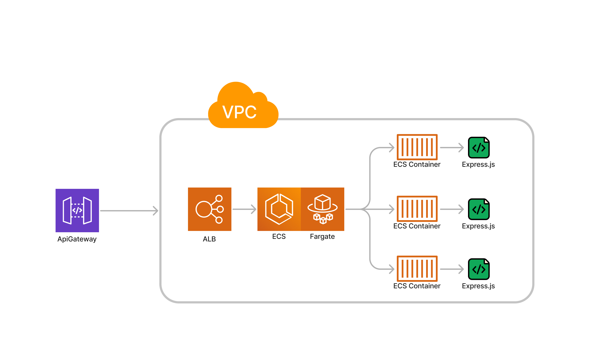

# Api Gateway + ECS Fargate POC

- see `NOTES.md` for useful descriptions of technologies used in this POC

## Project Overview

- `bin/app.ts` - defines the application, which has only 1 stack.
- `lib/main.ts` describes the applications "main stack" which includes an ApiGateway and HTTP Endpoint, VPC, Application Load Balancer, ECS Cluster, Fargate Integration
- `api/` folder contains an Express.js application (`api/src/index.ts`), its dependencies (`api/package.json`) and its Docker Container Image definition (`api/Dockerfile`). `docker build` and `docker compose` will be executed by the ECS Service as an ECS Task. (NOTE: this image is built at deploy time on the host machine i.e. your laptop)
- `cdk.json` file tells the CDK Toolkit how to build and execute your app.

## Deploy Instructions

1. clone the repo and cd into it
2. `npm install`
3. `npx cdk bootstrap` (this will use your default AWS profile, see `NOTES.md` for details and options)
4. `npx cdk deploy`

## Other Useful commands

- `npm run build` compile typescript to js
- `npm run watch` watch for changes and compile
- `npm run test` perform the jest unit tests
- `cdk deploy` deploy this stack to your default AWS account/region
- `cdk diff` compare deployed stack with current state
- `cdk synth` emits the synthesized CloudFormation template
